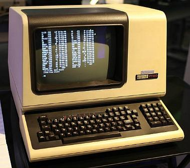

# *The* Terminal

* `Terminal.app`
* I've heard that iTerm is good 🤷‍♂️

## What I've changed
* Gray on black
* No scrollbar
* No bell!
* No transparency
* <kbd>Command</kbd>+<kbd>c</kbd> & <kbd>Command</kbd>+<kbd>v</kbd> works as expected (only on Mac though)

## No current issues
* It's just a terminal

[Next Chapter - Tmux, part 1](04-tmux-part1.md)